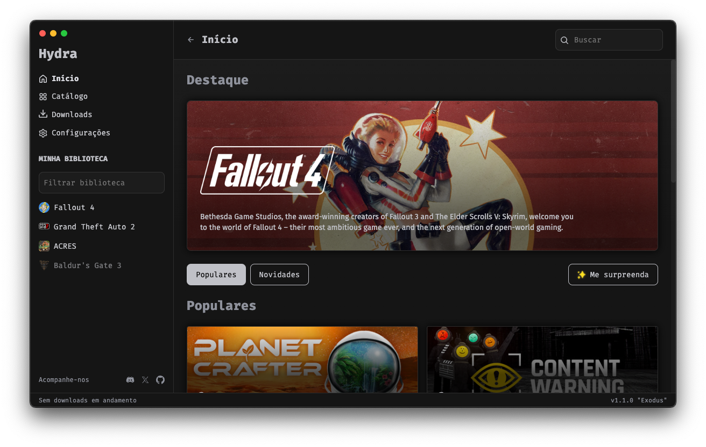

 

  <h1 align="center">Hydra Launcher | PortableApps.com</h1>

  

    <strong>Hydra is a game launcher with its own embedded bittorrent client. (now portable)</strong>
  

## About

**Hydra** is a **Game Launcher** with its own embedded **BitTorrent Client**.
 
The launcher is written in TypeScript (Electron) and Python, which handles the torrenting system by using libtorrent.

## Features

- Portable version of Hydra
- Own embedded bittorrent client
- How Long To Beat (HLTB) integration on game page
- Downloads path customization
- And more ...

## Installation

Follow the steps below to install:

1. Download the latest version of Hydra from the [Releases](https://github.com/vaclavec/hydraportable/releases/latest) page.
   - Download only paf.exe if you want to install Hydra on Windows PortableApps.com platform.
2. Run the downloaded file via PortableApps.com launcher.
3. Enjoy Hydra!

## License

Hydra is licensed under the [MIT License](LICENSE).
